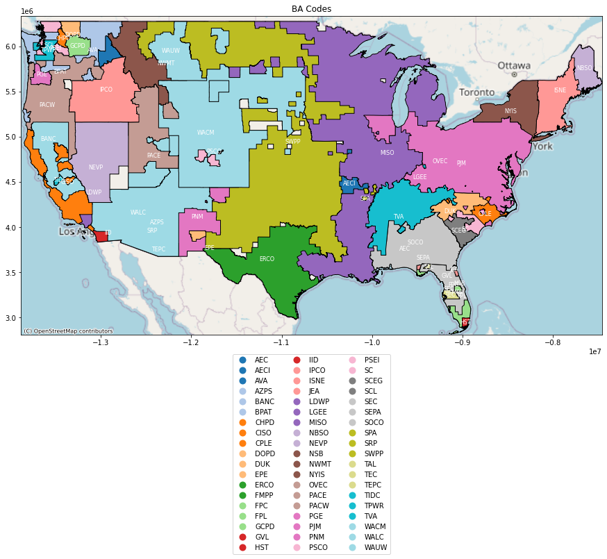
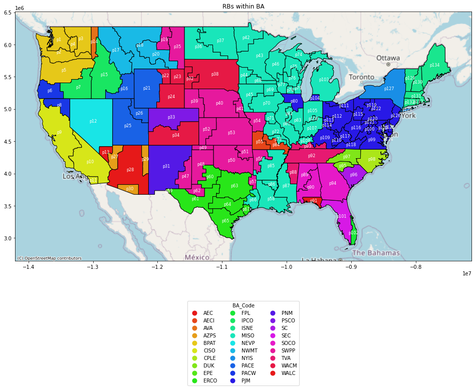
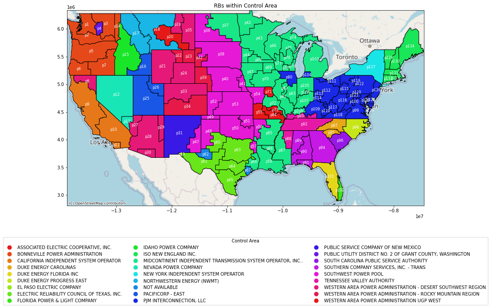

# Repurpose Directory


This directory is the successor to [data-download](https://github.com/pandaanson/data-download).







**Note**: Please refer to the node folder for more info

## Features

- **Mapping Creator**: Fully implemented. This tool is responsible for generating all the visualizations and mappings. Note that this code is tailored to specific datasets and might not be compatible with arbitrary input data.
- **EIA Examination**: Conducts analysis on the EIA dataset to extract insightful information.


## Roadmap

- Mapping (Mapping Creator)
  - county weather ===Mapping===> subregion weather (data generation for TELL)


## Tasks

### Feb 26 Task

- [X] Create Repo
- [X] Fix empty and keep only continental USA
- [X] Create mapping for subregion to region

### Feb 27 Task

- [X] Create Code to automate generate historical and future data

## Note:

For generated file:

### Historical:
- **File Name:** 1984_01_01_02_UTC_County_Mean_Meteorology.csv
- **Columns:** FIPS, T2, Q2, U10, V10, SWDOWN, GLW

### Future:
- **File Name:** 2049_01_01_02_UTC_County_Mean_Meteorology.csv
- **Columns:** FIPS, T2, Q2, U10, V10, SWDOWN, GLW

### Target file:

#### Historical:
- **File Name:** AEC_WRF_Hourly_Mean_Meteorology_2015.csv
- **Columns:** Time_UTC, T2, Q2, SWDOWN, GLW, WSPD

#### Future:
- **File Name:** AEC_WRF_Hourly_Mean_Meteorology_2020.csv
- **Columns:** Time_UTC, T2, Q2, SWDOWN, GLW, WSPD


## Feb 29 Task

- [ ] Prepare data for TELL training

### Note for TELL:

TELL file requires specific column names with units:

```python
# Rename the columns to add the units to each variable:
df.rename(columns={
    "DF": "Forecast_Demand_MWh",
    "Adjusted D": "Adjusted_Demand_MWh",
    "Adjusted NG": "Adjusted_Generation_MWh",
    "Adjusted TI": "Adjusted_Interchange_MWh"}, inplace=True)
```

## Training Data Structure

For training, the dataset includes the following columns:
- Year
- Month
- Day
- Hour
- Forecast_Demand_MWh
- Adjusted_Demand_MWh
- Adjusted_Generation_MWh
- Adjusted_Interchange_MWh
- Total_Population
- T2
- Q2
- SWDOWN
- GLW
- WSPD


### Subregion Analysis

#### Mar 3 Task

- [X] Play with demand data  
  **Note:** Some BAs are GENERATION-ONLY BAs.

#### Mar 4 Task

- [X] Create the mapping between BA and the 'rb'  

## Mar 5 Task

- [ ] ReEDS Load data and compare

### Note for Such data set:

### Importand rb


