# Repurpose Directory


This directory is the successor to [data-download](https://github.com/pandaanson/data-download).

**Note**: This code is specifically designed for our use case and is not intended to process other input formats.

## Features

- **Mapping Creator**: Fully implemented. This tool is responsible for generating all the visualizations and mappings. Note that this code is tailored to specific datasets and might not be compatible with arbitrary input data.
- **EIA Examination**: Conducts analysis on the EIA dataset to extract insightful information.

## Data Sources

1. **TELL Data**: Calibration and evaluation notebook from the TELL project.
   - [TELL MLP Calibration Evaluation Notebook](https://github.com/IMMM-SFA/tell/blob/main/notebooks/tell_mlp_calibration_evaluation.ipynb)
```python
   import tell
   current_dir = os.path.join(os.path.dirname(os.getcwd()))
   tell_data_dir = os.path.join(current_dir, 'tell_data')
   tell.install_tell_raw_data(data_dir=tell_data_dir)
   tell.install_quickstarter_data(data_dir=tell_data_dir)
   tell.install_sample_forcing_data(data_dir=tell_data_dir)

```
Population come from here

2. **County Shape File:** `cb_2018_us_county_500k.zip` [11 MB]  
   [US Census Bureau Cartographic Boundary Files](https://www.census.gov/geographies/mapping-files/time-series/geo/carto-boundary-file.html)

3. **County Base Weather Data:**  
   [OSTI.GOV Weather Data](https://www.osti.gov/biblio/1960548)

4. **Detailed Weather Data:**  
   [OSTI.GOV Detailed Weather Data](https://www.osti.gov/biblio/1885756)  
   This is used as a reference grid.

5. **RB Shape File:**  
   [NREL ReEDS 2.0](https://github.com/NREL/ReEDS-2.0)

6. **EIA Demand Data:**  
   [U.S. EIA Grid Monitor](https://www.eia.gov/electricity/gridmonitor/about)

7. **Control Area Shape File:**  
   [HIFLD Control Areas](https://hifld-geoplatform.hub.arcgis.com/datasets/geoplatform::control-areas/explore?location=33.336357%2C-112.615515%2C3.65)

8. **Subregion Level Data:**  
   [EIA Cleaned Hourly Electricity Demand Code](https://github.com/truggles/EIA_Cleaned_Hourly_Electricity_Demand_Code/blob/master/step1_get_eia_demand_data.ipynb)


## Roadmap

- Mapping (Mapping Creator)
  - county weather ===Mapping===> subregion weather (data generation for TELL)


## Tasks

### Feb 26 Task

- [X] Create Repo
- [X] Fix empty and keep only continental USA
- [X] Create mapping for subregion to region

### Feb 27 Task

- [X] Create Code to automate generate historical and future data

## Note:

For generated file:

### Historical:
- **File Name:** 1984_01_01_02_UTC_County_Mean_Meteorology.csv
- **Columns:** FIPS, T2, Q2, U10, V10, SWDOWN, GLW

### Future:
- **File Name:** 2049_01_01_02_UTC_County_Mean_Meteorology.csv
- **Columns:** FIPS, T2, Q2, U10, V10, SWDOWN, GLW

### Target file:

#### Historical:
- **File Name:** AEC_WRF_Hourly_Mean_Meteorology_2015.csv
- **Columns:** Time_UTC, T2, Q2, SWDOWN, GLW, WSPD

#### Future:
- **File Name:** AEC_WRF_Hourly_Mean_Meteorology_2020.csv
- **Columns:** Time_UTC, T2, Q2, SWDOWN, GLW, WSPD


## Feb 29 Task

- [ ] Prepare data for TELL training

### Note for TELL:

TELL file requires specific column names with units:

```python
# Rename the columns to add the units to each variable:
df.rename(columns={
    "DF": "Forecast_Demand_MWh",
    "Adjusted D": "Adjusted_Demand_MWh",
    "Adjusted NG": "Adjusted_Generation_MWh",
    "Adjusted TI": "Adjusted_Interchange_MWh"}, inplace=True)
```

## Training Data Structure

For training, the dataset includes the following columns:
- Year
- Month
- Day
- Hour
- Forecast_Demand_MWh
- Adjusted_Demand_MWh
- Adjusted_Generation_MWh
- Adjusted_Interchange_MWh
- Total_Population
- T2
- Q2
- SWDOWN
- GLW
- WSPD


### Subregion Analysis

#### Mar 3 Task

- [X] Play with demand data  
  **Note:** Some BAs are GENERATION-ONLY BAs.

#### Mar 4 Task

- [ ] Create the mapping between BA and the 'rb'  

  **Note:** Unique Balancing Authority values in SUBREGION include 'CISO', 'ERCO', 'ISNE', 'MISO', 'NYIS', 'PJM', 'PNM', 'SWPP'.  

  And from the data source:  
  - **California Independent System Operator (CISO):** No subregion map provided.  
  - **Electric Reliability Council of Texas, Inc. (ERCO):** Uses weather mapping as subregion; demand piece and clear mapping/region not provided.  
  - **Midcontinent Independent System Operator, Inc. (MISO):** Local Resource Zones mapped to Local Balancing Authorities as follows:
    - 1: DPC, GRE, MDU, MP, NSP, OTP, SMP
    - 2: ALTE, MGE, MIUP, UPPC, WEC, WPS
    - 3: ALTW, MEC, MPW
    - 4: AMIL, CWPLP, GLH, SIPC
    - 5: AMMO, CWLD
    - 6: BREC, CIN, HE, HMPL, IPL, NIPS, SIGE 
    - 7: CONS, DECO
    - 8: EAI
    - 9: CLEC, EES, LAFA, LAGN, LEPA
    - 10: EES, SME

  - **New England ISO (ISNE):** This is perfect  
    


  - **New York Independent System Operator (NYIS):**

  - **PJM Interconnection, LLC (PJM):**wasnot perfect seeming like the subregion is smaller then rb

  - **Public Service Company of New Mexico (PNM):**This one the rb does not serperate at all 

  - **Southwest Power Pool (SWPP):**


### Problematic BA and rb Mapping

- **GCPD p4:**  
  
- **WAUM p20:**  
  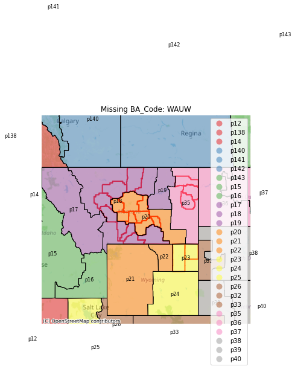
- **SPA p84:** Overlap multiple rb  
  

- **TEPC p27:**
  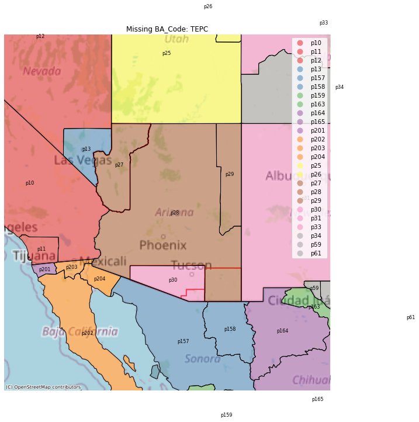

- **TPWR p1:**
  

- **DOPD p3:**
  

- **JEA p3:**
  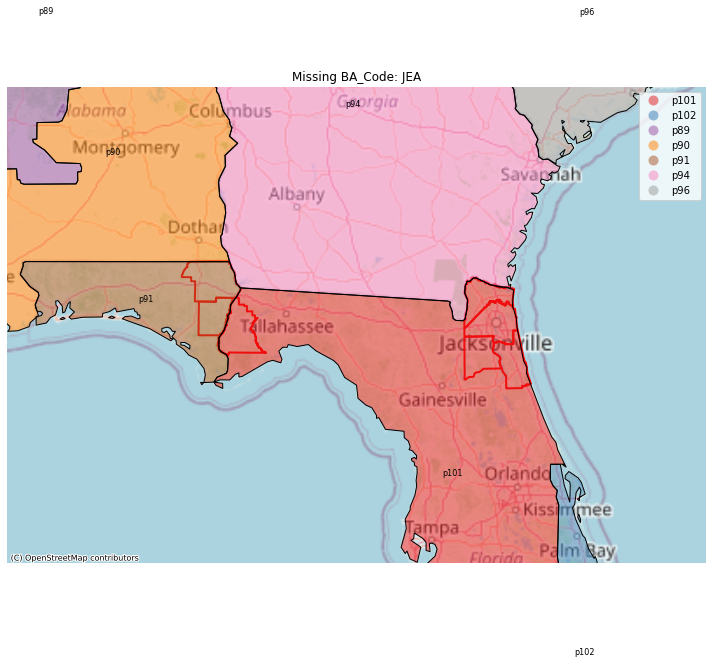
Two small piece

- **FMPP p102:**
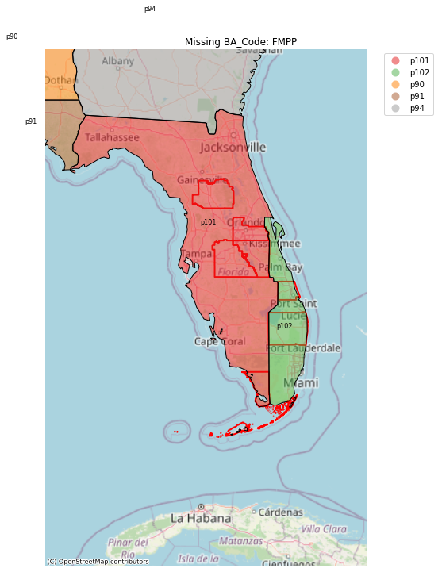

- **CHPD p1:**CHPD cross p1 and p3
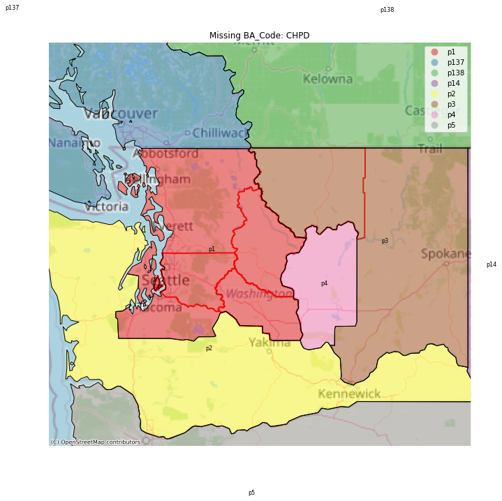


```python
{
    "GCPD": "p4",
    "WAUM": "p20",
    "SPA": "p84",
    "TEPC": "p27",
    "TPWR": "p1",
    "DOPD": "p3",
    "JEA": "p3",
    "FMPP": "p102",
    "CHPD": "p1"
}
```


### BA to rb Specific Cases

- **LDWP p10:** Too small to capture  
  

- **LGEE p108,p109:** Overlap with other major BAs  
  

- **LDWPPGE p5:** 

too small ti detect

- **LDWP- **LDWPSRP p28:** 
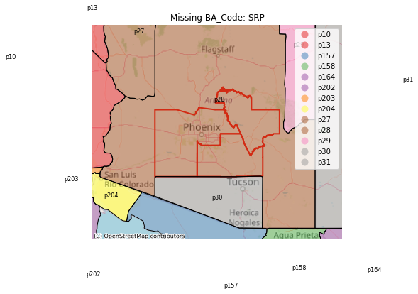

- **TEC p101:** 
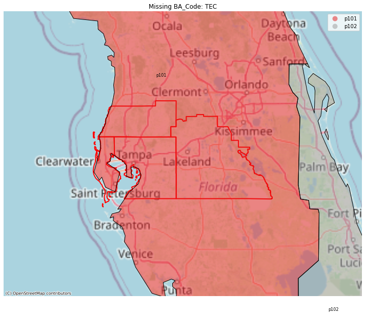

- **OVEC p112v
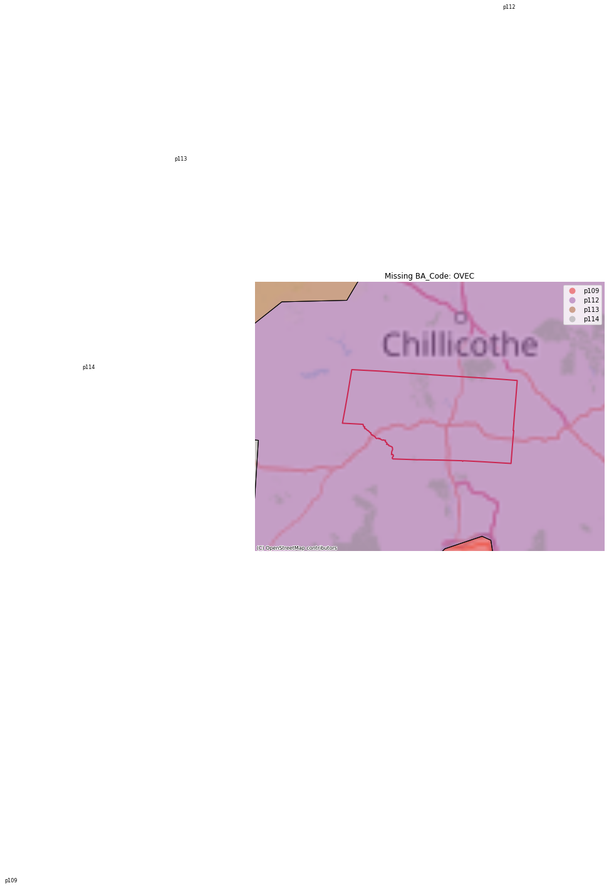
Too small

- **TAL p101:** 

Too small

- **BANC p9:** 

For BANC it is too small to capture by the existing code

- **PSEI p1:** 
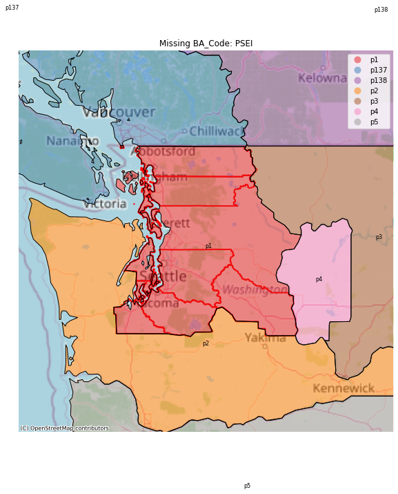
too fregmented

- **SCL p1:** 
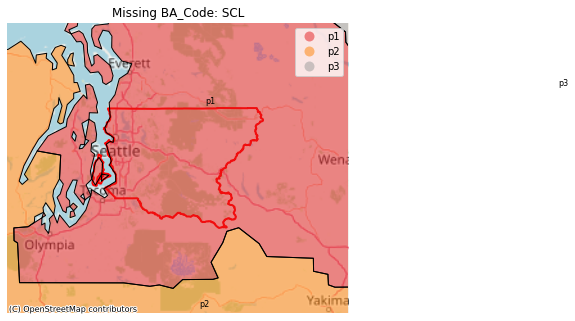
Too small to capture by the original code

- **NBSO p34:** 

compete within a rb just too small

- **FPC p101:** slighly too big


- **NSB p101:** Extend to the sea


- **HST p102:** island
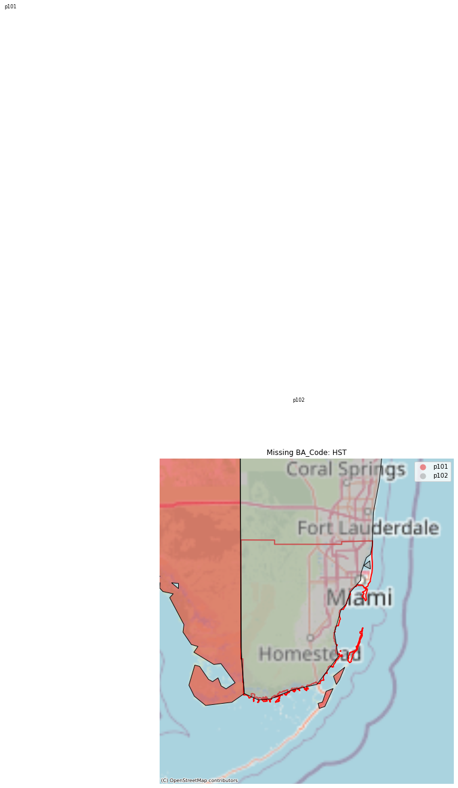

- **SEPA p94:** too small


- **SCEG p96:** Slightly larger than than rb


- **GVL p101:** too small


- **IID p10:** too small
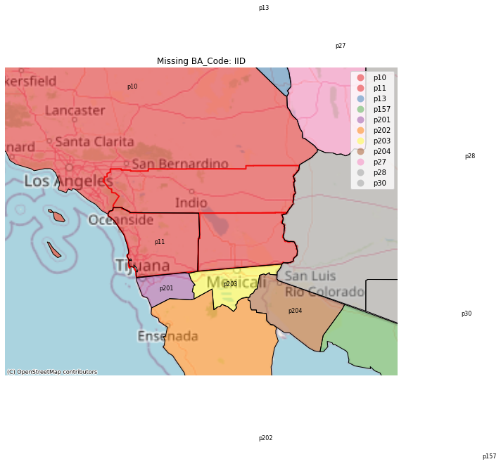

- **TIDC p9:** too small
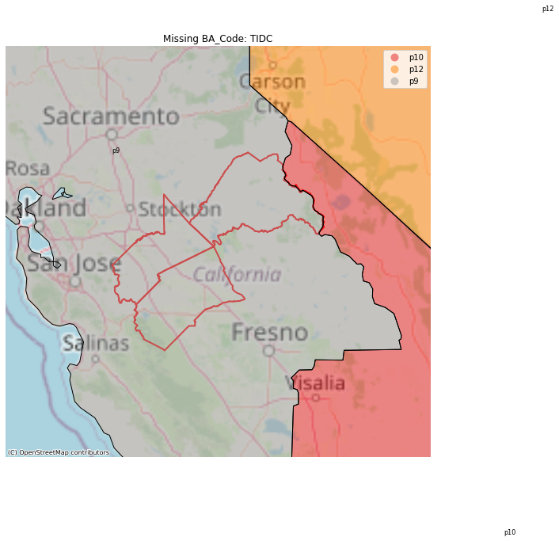


```python
{
    "LDWP": "p10",
    "GCPD": "p109",
    "LGEE": ["p109","p108"],
    "PGE": "p5",
    "SRP": "p28",
    "TEC": "p101",
    "OVEC": "p112",
    "TAL": "p101",
    "BANC": "p9",
    "PSEI": "p1",
    "SCL": "p1",
    "NBSO": "p34",
    "FPC": "p101",
    "NSB": "p101",
    "HST": "p102",
    "SEPA": "p94",
    "SCEG": "p96",
    "GVL": "p101",
    "IID": "p10",
    "TIDC": "p9"
}
```

### Generation-Only BAs
consist of a power plant or group of power plants and do not directly serve retail customers. Therefore, they only report net generation and interchange and do not report demand or demand forecasts.

Entities like Avangrid Renewables, LLC (AVRN) and others are generation-only, not serving retail customers directly.

- **Avangrid Renewables, LLC (AVRN)**
- **Arlington Valley, LLC – AVBA (DEAA)**
- **GridLiance (GLHB)**
- **Gridforce Energy Management, LLC (GRID)**
- **Griffith Energy, LLC (GRIF)**
- **Gila River Power, LLC (GRMA)**
- **NaturEner Power Watch, LLC (GWA)**
- **New Harquahala Generating Company, LLC – HGBA (HGMA)**
- **Southeastern Power Administration (SEPA)**
- **NaturEner Wind Watch, LLC (WWA)**
- **Alcoa Power Generating, Inc. – Yadkin Division (YAD)**

```python
{'AVRN',
 'DEAA',
 'GLHB',
 'GRID',
 'GRIF',
 'GRMA',
 'GWA',
 'HGMA',
 'WWA',
 'YAD'}
```
### RETIRED BALANCING AUTHORITIES

Entities occasionally stop performing the BA role because their electric system is incorporated into another BA's system or they have made other arrangements. Five BAs retired after July 1, 2015, the first date of EIA-930 data availability:


- **Gila River Power, LLC (GRMA)** – Retired May 3, 2018
- **Ohio Valley Electric Corporation (OVEC)** – Retired December 1, 2018
- **Utilities Commission of New Smyrna Beach (NSB)** – retired January 8, 2020
- **Electric Energy, Inc. (EEI)** – retired February 29, 2020
- **PowerSouth Energy Cooperatives (AEC)** – retired September 1, 2021

## Rare but Problematic

- **DEAA-Arlington Valley**: Appears to be a production facility.
  
- **CPLW**: Located in p56.
  
- **EEI - Edison Electric Institute**: No specific issues listed, implies general problems.
  
- **WAUW**: [Balancing Authorities as of January 2017](https://www.wecc.org/Administrative/Balancing_Authorities_JAN17.pdf). Errors due to not matching shape; assigned to p18.
  
- **WAUE**: Possibly Western Area Power Administration—Upper Great Plains East. No specific issues listed, implies general problems.

Entities with issues include:
```json
{
 "CPLW": "Located in p56",
 "DEAA": "Production facility",
 "EEI": "General issues",
 "WAUE": "Possibly Western Area Power Administration—Upper Great Plains East",
 "WAUW": "Errors due to not matching shape; assigned to p18"
}


